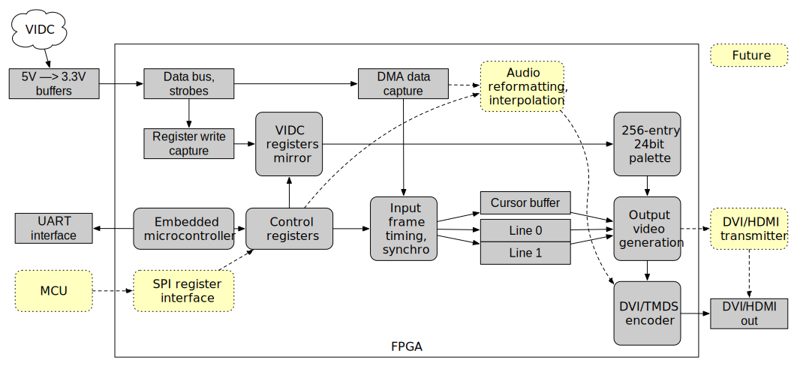

# ArcDVI: Digital video output for the Acorn Archimedes

30 Nov 2021

This repository contains an FPGA design and firmware allowing the Acorn Archimedes to output video via DVI.  Retrocompute on a real monitor! :)

In conjunction with an [adapter PCB](https://github.com/evansm7/ArcDVI-PCB) that plugs onto the Acorn VIDC chip, this design passively observes the VIDC signals in-circuit, and reconstructs the video display.  The video data is output digitally on DVI.  ArcDVI requires no software support from the Archimedes.

In addition to pass-through, doubling pixels in X and Y is supported to display TV/low-res screen modes on modern monitors.  For example, the 640x256 mode 12 is line-doubled and displayed as 640x512.

Not only does it look amazing, but it can provide new features.  For example:

   * The high-res mono mode 23 (1152x896) works beautifully on an A3000 (or A310) which otherwise doesn't have high-res mono hardware
   * High resolution modes (e.g. SVGA) without a VIDC enhancer, where an LCD monitor supports lower frame rate.  (I've been using mode 31 (800x600) at 37Hz stable and crisp on an LG monitor.)
   * Palette extension:  In the 1980s, silicon cost was a very limiting factor for storing large palettes.  The Arc has only 16 programmable 12-bit palette entries, but most FPGAs will have plenty of room to store a larger 256-entry palette -- and with 24-bit entries!

Plus, you're saved from the indignities of building a universally-working SCART cable!

This project is at _successful prototype_ stage.  A consolidated PCB design is the next step. 


## How it works



The VIDC signals are converted to 3.3V (on the adapter board) and the FPGA samples the data bus `D[31:0]` and `/VIDW` strobe to capture configuration register writes.  (The VIDC is write-only!)  VIDC registers are mirrored internally and used to infer which screen mode to use, the cursor (pointer) position, and palette entries.

The data bus is also used when the (real) VIDC requests DMA, which it does for video, cursor or sound FIFO fills.  The circuit demultiplexes these three streams.  The video data fills a line buffer (and cursor data a cursor buffer).

The line buffer is double-buffered, so a stable input line is displayed while the next line is being captured.  Each pixel is scanned out twice to double in X, and/or each buffer is displayed twice to double in Y.

To do this, the output scan must be in close synchronisation to the input video data.  This way, only one line needs to be buffered (minimising hardware requirements).  The scan-out runs exactly one line behind the input (two when doubling), to display stable data.

This also means the vertical timing matches the input exactly so that a frame input takes exactly the same time as output.

A non-expanded Archimedes (prior to A540/A5000 era) has a pixel clock derived from a 24MHz input.  This design always outputs with a 24MHz pixel clock.  Slower modes (e.g. 8MHz/16MHz) end up getting doubled, and the challenge arises to output one horizontal line in exactly the same total period as the input (or half of, when doubling in Y).

### High-res mono

To display mode 23 (1152x896@64Hz), a separate build is provided that uses a 78MHz pixel clock.  This is the VIDC 24MHz clock times 3.25.  The Arc was designed to use a 96MHz pixel clock because it was easier to create than something more reasonable (like 80MHz).  Mode 23 has unusually large horizontal blanking to compensate.

A mode 23 line is 1568 pixels (at 96MHz) wide.  The ratios are such that 1274 pixels at 78MHz take exactly the same period, and 1274 is wide enough to leave just enough blanking time (after 1152 displayed pixels).

### Microcontroller

A microcontroller observes the VIDC register state, controlling new output configurations appropriately.  This is currently an embedded `picorv32` CPU.  This is fun for development/debug, but the performance requirements between the MCU and the video registers are very low.  In future, an external MCU will be used (via an SPI-like interface).

### DVI video output

Today, the DVI video is output using Mike Field's `vga2dvid` module, via DDR output FFs.  This makes for a low-fuss DVI output; the ULX3S board has an HDMI(-like) socket with diff pairs AC coupled to the FPGA, and PMODs exist to provide DVI output on other FPGA boards.

The "soft-DVI" is also fun for development, but poses certain performance problems (i.e. not meeting timing for high-res modes) and was not universally well-received by my monitors.  In future, an external DVI/HDMI transmitter will be considered.


## Building FPGA bitstream

The prototype system uses an ULX3S Lattice ECP5 board, and builds using Yosys/nextpnr-ecp5.  The firmware build requires an RV32Iish toolchain.

```
make CROSS_COMPILE=/path/to/riscv32-unknown-elf- bitstream
```
This will work with monitortype 1 and most screen modes.

Other ECP5 platforms should be easy to add to the `platforms` directory, and can be selected by setting the `BOARD` Makefile variable.

Non-ECP5 FPGA platforms aren't supported (yet).

Support for HiRes mono modes (mode 23) is a special build (which statically configures 78MHz pclk instead of 24MHz):

```
make ... HIRES_MODE=1 bitstream
```
Then, configure monitortype to 2.


## Safari

### Hardware

`src/soc_top.v` is the top-level.  `clocks.v` generates one clock for the MCU/register interfaces, a pixel clock and a 5x pixel clock for the DVI output stream.

`vidc_capture.v` monitors the VIDC pins, captures the VIDC registers, and demuxes the DMA streams.  It passes those streams/strobes to `video.v` which contains the video output configuration registers, and into `video_timing.v` which generates the output display timing and display data from the DMA stream.  24b RGB, Hsync, Vsync and blanking is exported back to the top level where (currently) `vga2dvid` is instantiated to output the DVI signal.

### Firmware

Starting at `firmware/main.c`, a simple top-level loop polls registers that indicate if the VIDC `HCR`/`VCR` values have been written (as happens on a mode switch).  If so, `video.c:video_probe_mode()` selects an appropriate output configuration given VIDC's configuration.

Aside from a whole lot of debugging/development features (such as `commands.c` which provides a super-simple CLI to tweak config via UART console), the core responsibility of the firmware is `video_probe_mode()`.

## What works

All normal desktop/game screen modes work correctly.  Generally, anything with a 320x256/640x256/640x480/640x512/800x600 resolution (at any colour depth) should display correctly.

In addition, minor variants of mode 13 (e.g. games, demos) should work nicely.  For example, 320x272 gets doubled to 640x544 and displays correctly.

### Extended colour
Some initial work is present in this tree to expand the colour capabilities.  See the `INCLUDE_HIGH_COLOUR` define, which:

   * Makes the 8bpp palette fully programmable:  two special "hidden" registers are added at VIDC reserved addresses `0x50`/`0x54`.  (In VIDC, these reserved locations alias to the adjacent border/cursor palette registers, which are benign to write.)  The second location is a data payload, and the first is an "operation" trigger.  By writing a 24-bit `0x0000RR` operation value, palette entry `RR` is written with the RGB value previously provided in the payload.
    * 256 greys look great!
   * Extends the palette entries from 12 to 24 bits.
   * Adds a BGR565 mode: there isn't yet a mechanism to request this by a custom Arc screen mode (e.g. another bit in the VIDC Control Register), but it works.  For example, 640x256x8 is output as 320x256x16.

This logic isn't included by default (bigger, slower, unused by regular software).


## Work in progress/ToDo list

   * A non-prototype PCB to create a proper DVI adapter!
   * Support for other FPGA vendors/platforms/toolchains.
   * The pointer doesn't work properly.  It looks good in VGA-like modes, but is smushed in X- or Y-doubled modes.  (It looks manky in mode 23 too.)  Even in VGA-like modes, the hourglass is still corrupt.
   * Implement switchable/reprogrammable pixel clocks:
    * Remove the need for a different HIRES_MODE build.  This isn't terrible given you have to reconfigure the Arc anyway, but would be nice to have one build.
    * A 24MHz pixel clock is good for most modes.  But, some very wide modes, e.g. mode 24/1056x256, will fail to be line-doubled because a 24MHz pixel clock isn't fast enough to output enough pixels in half the period.  Support a 36/48MHz pixel clock for such modes.
   * Harmonise the palette hacks:
    * One palette for all modes, instead of one for 1/2/4bpp and one for 8bpp.
    * Correctly generate the traditional 256 colours using the 16 colour palette.
   * Support digital sound output:
    * Output via S/PDIF, or HDMI audio if using an external HDMI encoder (e.g. something like an ADV7511).
    * Interpolation for both output rate conversion to >=44.1KHz and 8b log to 16b PCM.
   * Hsync-based palette switching techniques (e.g. RasterMan) don't currently work, because video lines are displayed one line later than VIDC.  This can be fixed by buffering palette updates to delay them by one line (but costs buffering).
   * Implement SPI interface for external management MCU.
   * Prototype full frame buffering:  this is only particularly useful for reducing the VIDC bandwidth by using a very low refresh rate (e.g. 15Hz) in a high res mode.  The key factor is the lower bound of refresh rate that monitors/TVs will sync to.  This is costly, a more complicated design and an additional memory chip.


## Next steps (AKA The Vision)

The prototype works well, and proves the concept.  Next, design a board that carries a small FPGA, HDMI encoder, and MCU.

Some Archimedes machines have a socketed VIDC (e.g. A310, A440), whereas others have a soldered VIDC (e.g. A3000).  The physical attachment would differ between the two, e.g. to clip around a soldered VIDC using an upturned PLCC socket, or to plug into a socket (carrying the VIDC in another socket).  This would mean two PCBs for different models.

The best approach seems to be to use one of two (electronically simple) interface boards that solve the VIDC connection issue and carry the level converters.  That would then carry a (common) daughterboard which provides the FPGA/HDMI logic.

Another physical problem to solve is getting the HDMI out in a nice way, particularly on the A3000 whose case doesn't easily have HDMI cable-sized gaps.  An FFC can fish through gaps and link to a small FFC-to-HDMI-socket board that mounts on the outside.


## References

(This link will probably break eventually, but) There's an ArcDVI thread on the StarDot forums with some photos/development notes:  <https://stardot.org.uk/forums/viewtopic.php?f=16&t=23772>


## Copyrights & licence

All sources in `src/` are copyright 2021 Matt Evans, and provided under the MIT licence.

The Lattice ECP5 bitstream-generation parts of `Makefile` are derived from the ULX3S examples `trellis_main.mk` (by Emard?).

The prototype uses the following external components (in `external-src/`):

   * `ecp5pll.sv`, from the ULX3S examples, is copyright Emard
   * `vga2dvid.v` and `tmds_encoder.v` (auto-converted from VHDL sources) are copyright 2012 Mike Field
   * `picorv32.v`, `picosocme.v` (derived from `picosoc.v`) and `simpleuart.v` are copyright 2015, 2017 Claire Xenia Wolf
